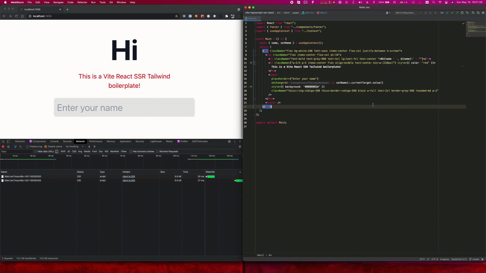

# Vite Typescript React 17 SSR

[](https://github.com/jonluca/vite-typescript-ssr-react/actions/workflows/nodejs.yml)

A *blazingly* modern web development stack. This template repo tries to achieve the minimum viable example for each of the following:



* [React 17](https://reactjs.org/blog/2020/10/20/react-v17.html)
* [Typescript 4.3](https://devblogs.microsoft.com/typescript/announcing-typescript-4-3-rc/)
* [Vite with Vite SSR](https://vitejs.dev/guide/ssr.html)
* [GitHub Actions](https://github.com/features/actions)
* [Tailwind CSS](https://tailwindui.com/)
* [Prettier](https://prettier.io/) & [ESLint](https://eslint.org/)

## Development

```
yarn
yarn dev
```

That should be enough to get started. It will open to http://localhost:7456

## Building

```
yarn build
yarn serve
```

yarn build will create the assets in `dist` - a `client` and `server` folder. Serve will run `dist/server.js` with Node, but feel free to change this to use Docker or some other process manager to suit your deployment needs.

## Files

`eslintrc.js` - a barebones eslint configuration for 2021, that extends off of the recommended ESLint config and prettier

`.prettierrc.js` - the prettier config

`index.html` - the vite entrypoint, that includes the entry point for the client

`postcss.config.cjs` - CommonJS module that defines the PostCSS config

`server.ts` - The barebones Express server with logic for SSRing Vite pages

`tailwind.config.cjs` - CommonJS module that defines the Tailwind config

`tsconfig.json` - TypeScript configuration

`vite.config.ts` - Vite configuration

## CI

We use GitHub actions to build the app. The badge is at the top of the repo. Currently it just confirms that everything builds properly.